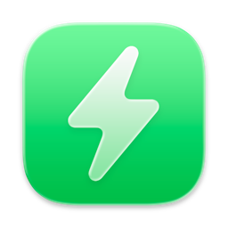

# 

<h1 align="center">AirBattery</h1>
<h3 align="center">Get battery usage of all devices on Mac and show them on the Dock / StatusBar / Widgets! </h3> 
<h3 align="center">DISCLAIMER: THIS IS NOT THE OFFICIAL REPO, THIS IS A FORK</h3>
<h4 align="center"><a href="https://github.com/lihaoyun6/AirBattery">Visit the official project()</a></h4>

## Installation and Usage
### System Requirements:
- macOS 11.0 and Later
- Android 4.0 and Later
- Tasker 4.2u3 (if you have it installed, you likely have a version higher than this)

### Installation:
1. Download the latest installation file [here](../../releases/latest) on your Mac
2. Open [tasker_airbattery_sender.js](https://github.com/Firebolt9907/AirBattery/blob/main/tasker_airbattery_sender.js) in a new tab, and copy the file contents into a text editor such as TextEdit
3. Replace the 4 variables in the configuration section to match your mac as shown in comments
4. Copy the file contents to your Android device (using Google Docs, KDE Connect Clipboard Sync, or a similar technology)
5. Create a Tasker task and add an action for "JavaScriptlet"
6. Paste the file contents into the code section
7. Scroll down, disable "Auto Exit", and reduce the "Timeout" to something below 15 seconds to reduce battery impact

### Usage: 
Shared with original:
- After AirBattery is started, it will be displayed on both the Dock and the status bar by default, or only one of them (can be configured)  
- AirBattery will automatically search for all devices supported by the **"Nearbility Engine"** without manual configuration.  
- Click the Dock icon / status bar icon, or add a widget to view the battery usage of your devices.  
- You can also use the **"Nearcast"** feature to check the battery usage of other Macs and their peripherals in the LAN at any time.  
- You can also change the status bar icon to a real-time battery icon in preferences, just like the one that comes with the system.  
- If necessary, you can hide certain devices in the Dock menu or status bar menu, and unhide them at any time.
Unique to this fork:
- The Nearcast feature now extends to Android devices that run the Tasker script above in the LAN or over Tailscale

## Q&A
**1. Why does the original not have Android support?**
> The creator has [mentioned](https://www.reddit.com/r/macapps/comments/1d7033b/comment/l6wbubx/?utm_source=share&utm_medium=web3x&utm_name=web3xcss&utm_term=1&utm_content=share_button) that there is no Android support, and while they didn't state why, I found out the hard way. The project uses [MultipeerKit](https://github.com/insidegui/MultipeerKit), which is exclusive to Apple devices.

**2. Why are you not requesting to merge this fork?**
> This fork has been vibe-coded into oblivion to create a local REST API server that runs a second instance of MultipeerKit for the Android device. While the HTTP server the app has is encrypted with the same private key as nearcast, it is still a janky solution, and I would rather the creator implement it themselves a more efficient way.

## Donate to the original creator
This fork would not be possible without lihaoyun6

